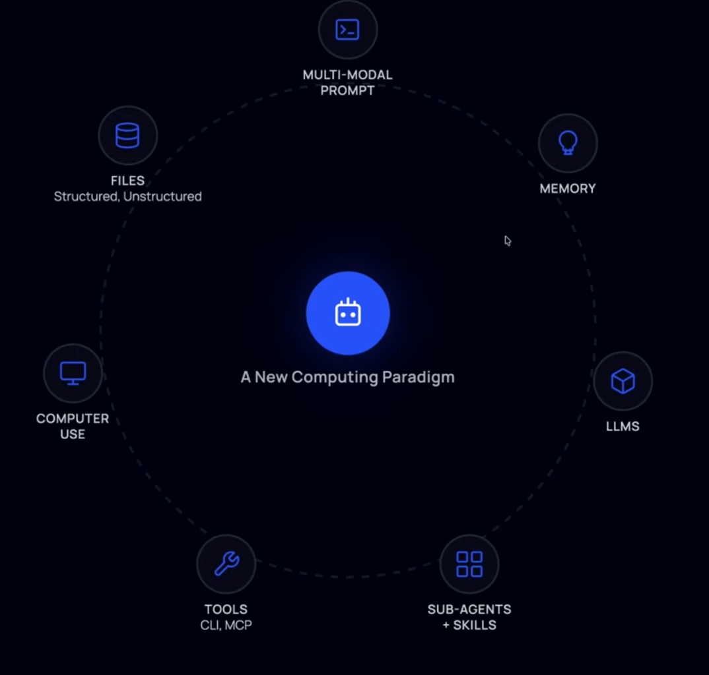
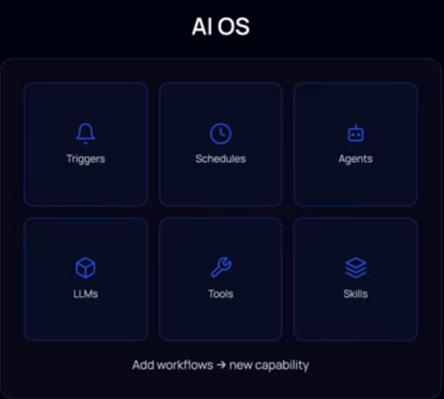
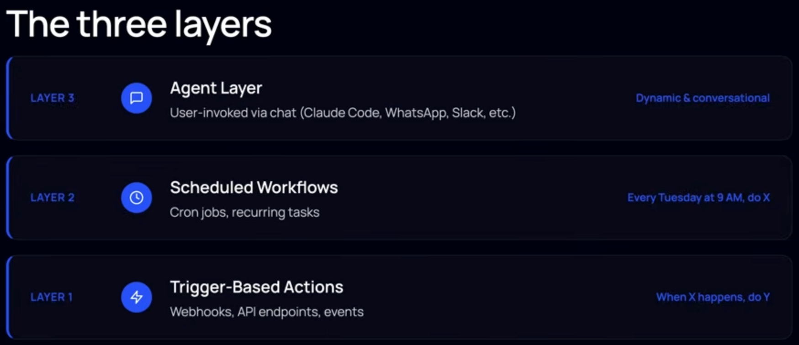
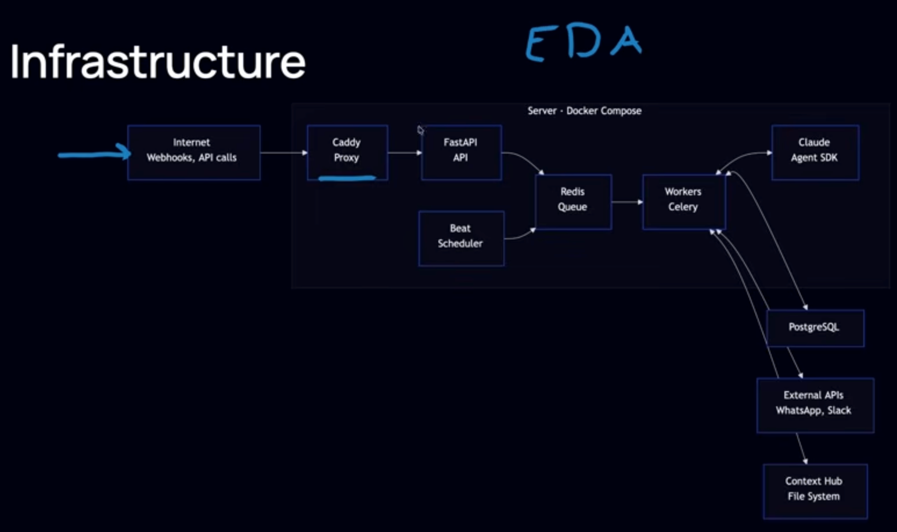
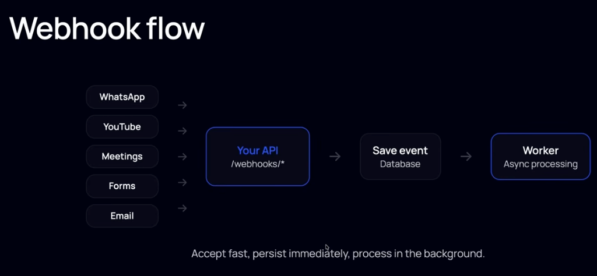
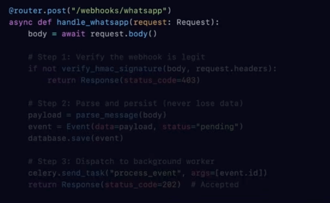
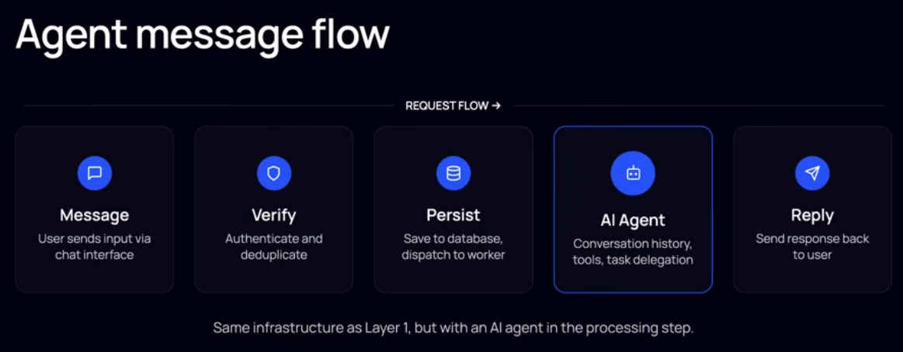
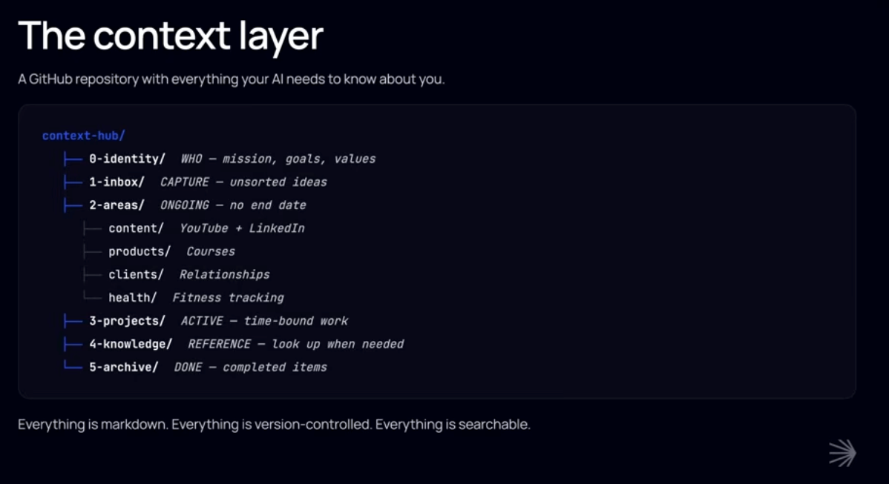
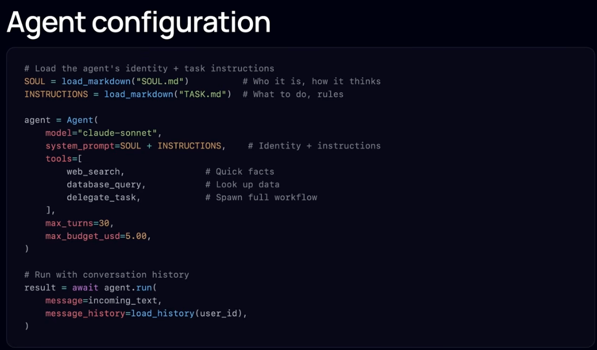

This project is about creating some type of "AI operating system" in a similar way as projects as openclaw, agentzero, agentpi...

I want to focus on maintaining the projet codebase as clear as possible, having defined the harnesses so that any developer can contribute in a good way by using vibe coding without sloping.

Together with the agentic documentation, the project will follow a very clean structure, separating each module by functionality, the main architectural patterns I want to use are:

- Dependeny injection, for permitting apporpiate mocking for testing
- Clean architeture, but not separating in folders like domain, application, infrastructure (modules are separated by functionality), bu applying that concepts internally
- Event-driven architecture
- Chain-of-responsibility for defining workflows
- This is based on the AI_operating_system_video_transcriptions.md but with some technological changes regarding for example not using celery but acustom queue db and worker and permitting fleximility on agent providers (not only claude agent sdk)

# Concepts

## Paradigm

## AI OS

## Three layers

## Infrastructure

## Layer 1

## layer 2

Scheduled workflows (worker + evenst db)

## layer 3

